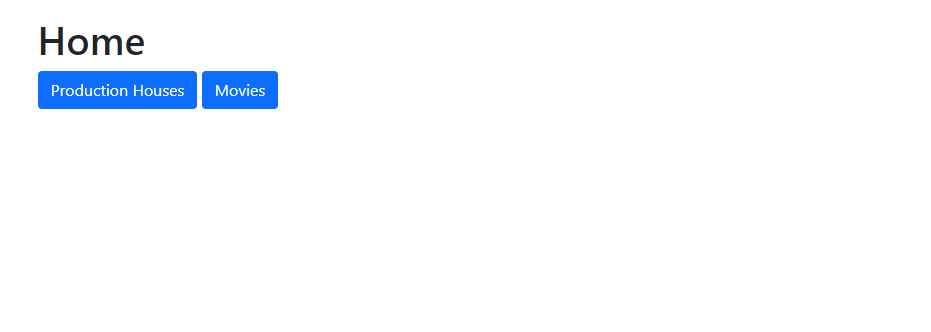
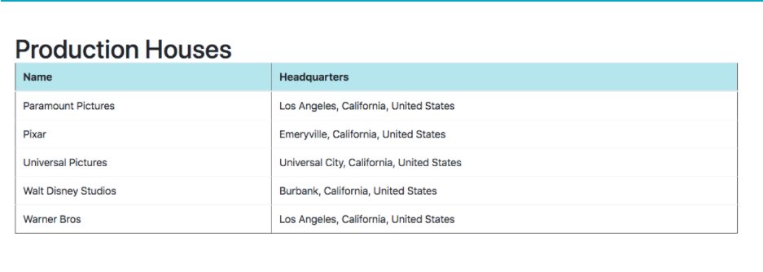
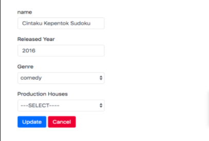
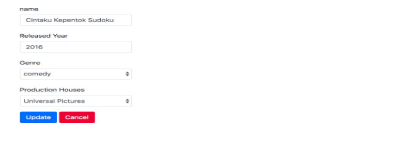

[](https://classroom.github.com/online_ide?assignment_repo_id=16266374&assignment_repo_type=AssignmentRepo)
# Movie Application


> Kerjakan di dalam folder movie-app

```txt
Pada simulasi ini terdapat optional Edit dan Validasi Server tapi saat Live Code, Edit dan Validasi merupakan hal yang wajib. 

Jika kalian sudah selesai simulasi (waktunya habis) buat pull request lalu lanjutkan secara mandiri, serta coba fitur Edit dan Validasi pada Add & Edit.

Jangan lupa untuk membuat .gitignore 
```

## Release 0
Buatlah *DATABASE* dengan menggunakan PostgreSQL dengan nama `simulasi-livecode`.
> Nama database WAJIB simulasi-livecode.

## Release 1
Buatlah file `setup.js` yang berfungsi untuk membuat table `ProductionHouses` untuk menyimpan data dari rumah produksi film yang memiliki kolom-kolom sebagai berikut:

| Field         | Datatype | Modifiers   |
| ------------- | -------- | ----------- |
| id            | SERIAL   | PRIMARY KEY |
| name_prodHouse| VARCHAR  |             |
| headquarters  | VARCHAR  |             |

setelah itu buatlah table `Movies` untuk menyimpan data film yang memiliki kolom-kolom sebagai berikut:
| Field         | Datatype | Modifiers   |
| ------------- | -------- | ----------- |
| id            | SERIAL   | PRIMARY KEY |
| name          | VARCHAR  |             |
| released_year | INTEGER  |             |
| genre  | VARCHAR  |             |
| ProductionHouseId  | INTEGER  | FOREIGN KEY            |

Gambaran relasi antara 2 table diatas adalah 1 ProductionHouse bisa memiliki banyak Movie dan 1 movie hanya bisa dimiliki oleh 1 ProductionHouse.

Sebelum membuat table diatas, wajib membuat Schema terlebih dahulu di draw.io yang nantinya di screenshoot dan dikumpulkan pada repo ini. 

Jalankan file `setup.js` untuk membuat table `ProductionHouses` dan `Movies` di dalam database `simulasi-livecode`.

## Release 2
Buatlah file `seed.js` yang berfungsi untuk melakukan seeding data ke dalam table `ProductionHouses` berdasarkan data dari `productionHouses.json`.

Jalankan file `seed.js` untuk melakukan seeding ke table `ProductionHouses`.

## Release 3

Buatlah routing dengan menggunakan `ExpressJS` agar dapat melakukan CRUD operations dengan detail sebagai berikut:

| Method | Route             | Keterangan                                                                                                               |
| ------ | ----------------- | ------------------------------------------------------------------------------------------------------------------------ |
| GET    | /                 | Menampilkan 2 link, link pertama untuk menggarah ke /production-houses dan link kedua ke /movies                                                                        |
| GET    | /production-houses                 | Menampilkan semua production house yang ada dalam database                                                                        |
| GET    | /movies        | Menampilkan semua movie yang ada dalam database                                                                    |
| GET    | /movies/add     | Menampilkan halaman form untuk menambahkan data movie                                                                  |
| POST   | /movies/add     | Menerima data yang dikirim dari halaman `/movies/add` untuk melakukan _insertion_ ke dalam table `movies`            |
| GET    | /movies/edit/:id     | Menampilkan halaman edit form beserta data movie berdasarkan `id` yang telah ter`populate`                                                                  |
| POST   | /movies/edit/:id     | Menerima data yang dikirim dari halaman `/movies/edit/:id` untuk melakukan _update_ ke dalam table `movies` berdasarkan `id` pada params            |
| GET    | /movies/delete/:id | Melakukan _delete_ data movie berdasarkan `id` yang ada pada params                                                      |


## Release 4
### Halaman Home atau Route `/`
Implementasikan routing `/` dengan membuat halaman `Home` dimana halaman ini menampilkan dua link menuju halaman `production-houses` dan `movies`.



## Release 5
### Halaman Production House atau Route `/production-houses`
Implementasikan routing `/production-houses` dengan membuat halaman `production-houses` dimana halaman ini menampilkan semua production house yang ada pada database dalam bentuk list yang terdiri dari kolom Name, dan Headquarters. Data yang ditampilkan harus berurut berdasarkan nama production house (ascending).



## Release 6
### Halaman Movie atau Route `/movies`
Implementasikan routing `/movies` dengan membuat halaman `movies` dimana halaman ini menampilkan semua movie yang ada pada database dalam bentuk list yang terdiri dari kolom Movie (name), Released Year, Genre, Production House dan Action. Data yang ditampilkan harus berurut berdasarkan movie yang terakhir keluar. Diatas table letakan 1 link "add" yang mengarah ke route `/movies/add`

Pada kolom Action ada 2 link yaitu:
1. Edit yang mengarah ke route `/movies/edit/:id`
1. Delete yang mengarah ke route `/movies/delete/:id`

Seperti contoh berikut:


## Release 7 `/movies/add`
### Halaman Add Movie atau Route `/movies/add`
Halaman add akan menampilkan form untuk memasukkan data movie yang akan disimpan ke dalam database. Gunakanlah dropdown untuk field genre seperti contoh berikut:



Form Add:

Name, input bertipe `text`

Released Year , input bertipe `number`

Genre, menggunakan select, berikut genre yang bisa dipilih:
- animation
- comedy
- drama
- horor
- religious
- thriller

Production House, menggunakan select, data prodcution house didapat dari database 

Apabila berhasil menambahkan movie maka halaman akan redirect route `/movies`


## Release 8
### Delete Movie atau Route `/movies/delete/:id`
Untuk mengimplementasikan routing ini, kamu tidak perlu membuat halaman baru, tapi cukup dengan menekan tombol delete yang akan mengarahkan routing ke `/movies/delete/:id` dimana proses delete akan dilakukan berdasarkan `id` yang dikirimkan. 

Apabila berhasil menghapus movie maka halaman akan redirect route `/movies`

## Release 9 (optional jika masih ada waktu)
### Edit Movie atau Route get dan post `/movies/edit/:id`
Pada halaman update data Movies, tampilkanlah data movie yang sudah ter-populate berdasarkan id.

Saat edit, genre dan production house harus terpopulate sesuai dengan data yang ada di database. Disini kamu akan mengimplementasi sedikit logic pengecekan kondisi.



Dan ketika tombol “Update” ditekan maka ubahlah data movie berdasarkan id-nya dan setelah berhasil, arahkan user kembali ke halaman movie list dan data harus sudah ter-update.


## Release 10 (optional jika masih ada waktu)
Pada add dan edit tambahkan validasi pada level server (*BUKAN VALIDASI DI HTML*):
- `name` tidak boleh kosong  
- `released_year` maksimal tahun 2021  

tampilkan pesan error minimal dengan res.send.
